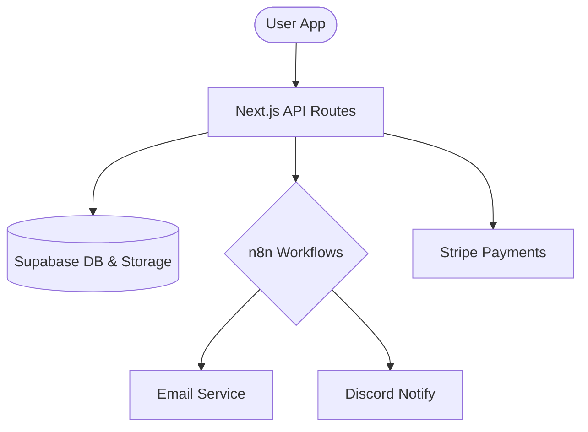

# Shonen Ark Architecture Guide

Shonen Ark is built as a hybrid monolith, leveraging Next.js for the core experience and n8n for complex back-office workflows.

## 🏗 System Overview

## 🛠 Backend Layers

### 1. Transport Layer (`pages/api`)
Handles HTTP requests. Uses `allowMethods` to restrict access and `sendSuccess`/`sendError` for uniform JSON responses.

### 2. Service Layer (`src/lib/services`)
Contains 100% of the business logic. API handlers should only call services.
- **SubscriptionService**: Manages Stripe customers and tiers.
- **ProjectService**: (Planned) Handles submissions and approvals.

### 3. Utility Layer (`src/lib`)
- **Logger**: Structured JSON logs for production observability.
- **Env**: Fail-fast environment variable validation.
- **Errors**: Standardized `AppError` taxonomy.
- **Webhook**: Centralized HMAC signature verification.

## 🛡 Security Model
- **Authentication**: Handled by NextAuth (v4).
- **Authorization**: Role-based access (admin, creator, fan) implemented via Supabase RLS.
- **Data Integrity**: Webhook signatures ensure requests from external providers (Stripe, n8n) are authentic.
